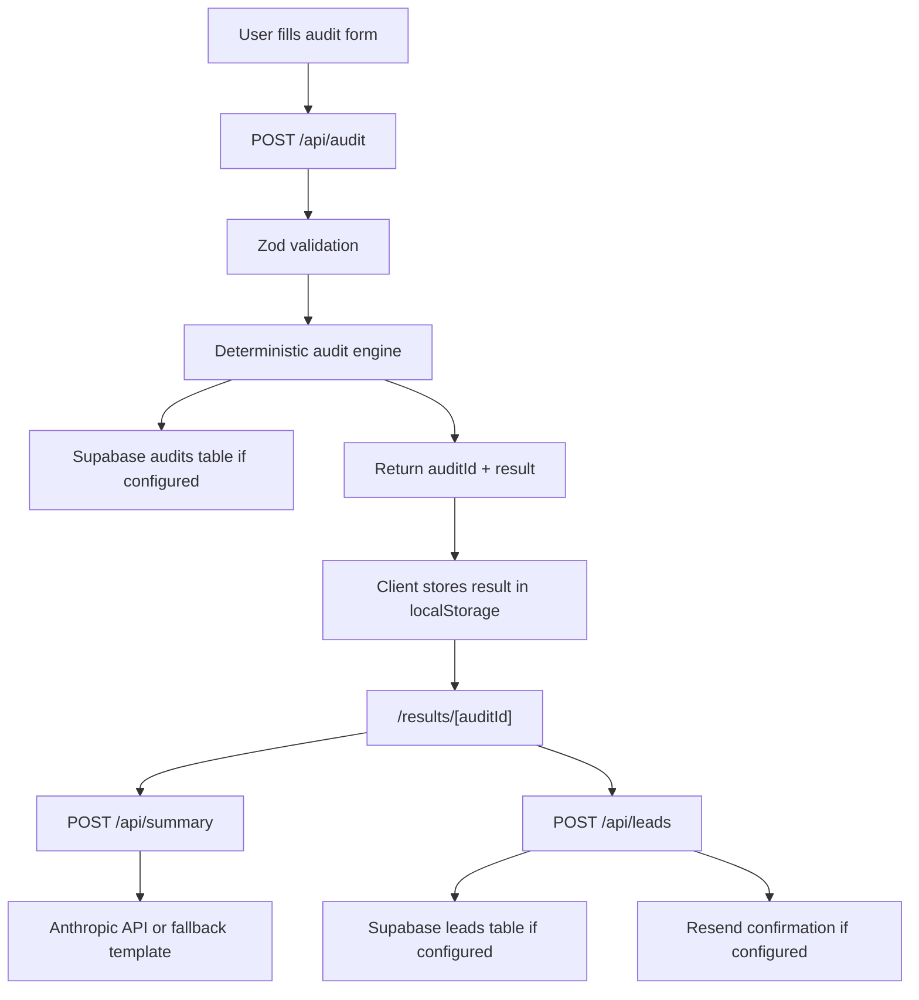

# Architecture

## Rationale

The audit engine is deliberately separate from the UI and API route so it can be tested without a browser or database. External services are adapters around the core flow rather than requirements for the core math.

The app stores the audit response in localStorage before navigation because serverless memory is not durable. Supabase is the production storage path, while localStorage keeps the deployed demo usable without credentials.
